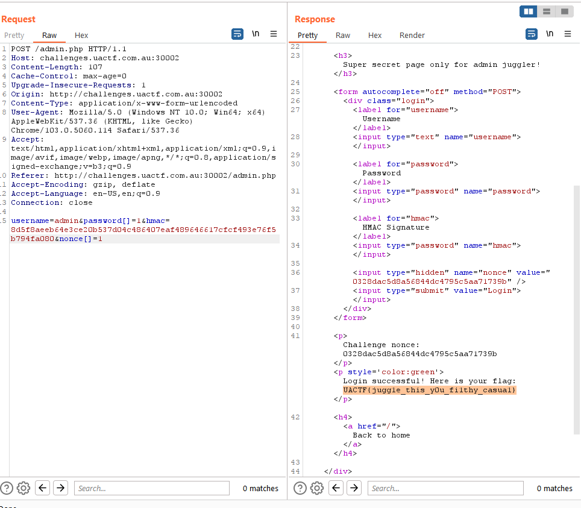

# 2022 - UACTF

## # Mở đầu

Mặc dù học mấy môn ở trên trường nhưng nay mới tập tành chơi nghiêm túc, mở đầu với 2 bài web đơn giản của UACTF ngày 30-31/8/2022 thôi nha, mình chỉ trình bày ý tưởng và logic để giải, câu cú có thể lủng củng mong mọi người thông cảm.

## # web

### 1. Trial by PHP

.png>)

### 2. Juggler&#x20;

Quan sát code php, ta thấy rằng để in được flag ta cần phải thực thi được hàm if. Mặc dù trong if có 3 điều kiện, nhưng ta chỉ cần chú ý đến 2 điều kiện:

* Điều kiện strcmp($\_POST\['password'], $password) == 0
  * Để bypass hàm strcmp, ta sẽ gởi password với định nghĩa array():
    * password\[]=1
    * Tham khảo thêm tại đây: [https://hydrasky.com/network-security/php-string-comparison-vulnerabilities/](https://hydrasky.com/network-security/php-string-comparison-vulnerabilities/)
* Điều kiện $\_POST\['hmac'] === $hmac
  * với điều kiện này thì ta cần gởi $\_POST\['hmac'] đúng bằng $hmac
  * do vậy ý tưởng của ta sẽ gởi những tham số 'nonce' và 'hmac' phù hợp để biết trước kết quả của biến hmac
  * tìm hiểu thêm về hàm hash\_hmac [https://www.php.net/manual/en/function.hash-hmac.php](https://www.php.net/manual/en/function.hash-hmac.php)
  * ta thấy ngay có một lỗ hổng có thể khai thác được
    * ta truyền tham số nonce là 1 mảng 0 phần tử: nonce\[]=1 để thu được $secret=NULL
    * thực hiện hàm hash\_hmac với giá trị cần mã hóa là admin và key là NULL --> khi đó ta thu được giá trị của $hmac

.png>)

.png>)

.png>)
